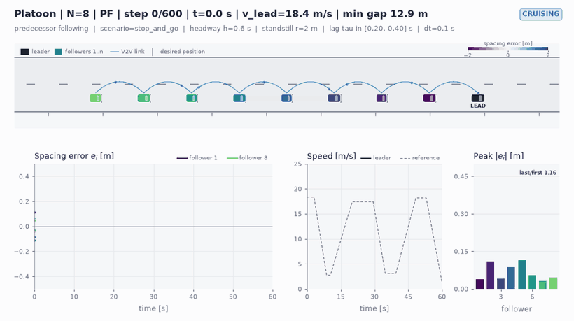
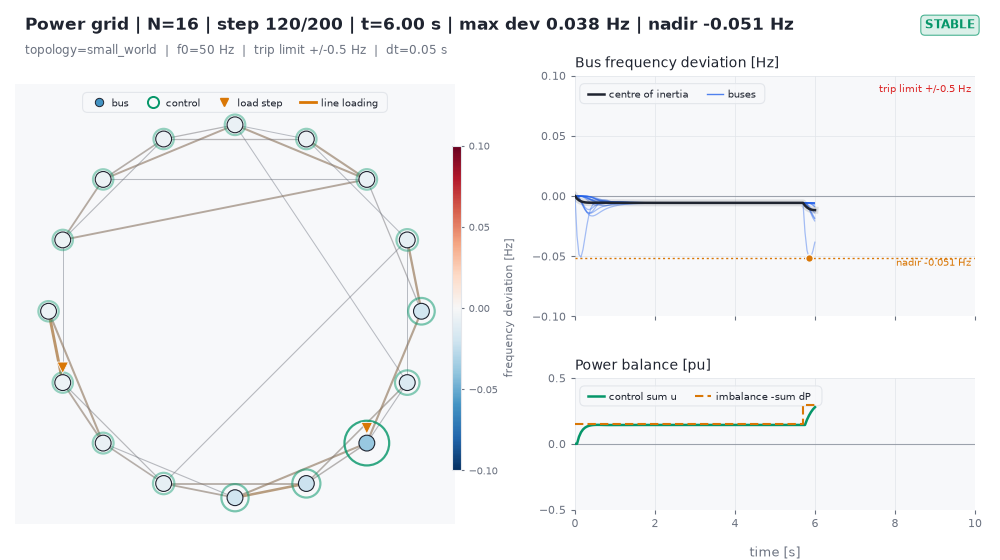
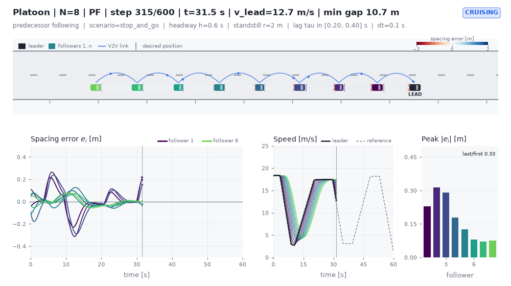
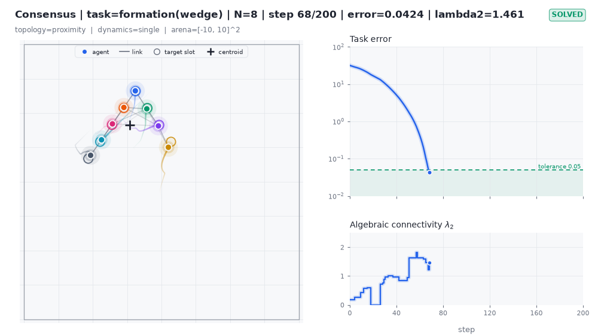
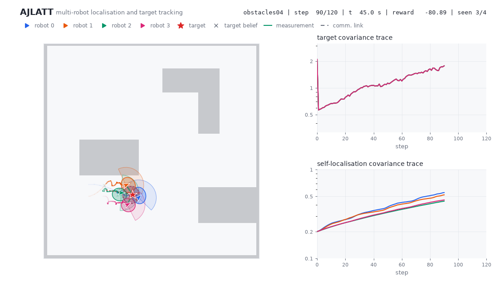
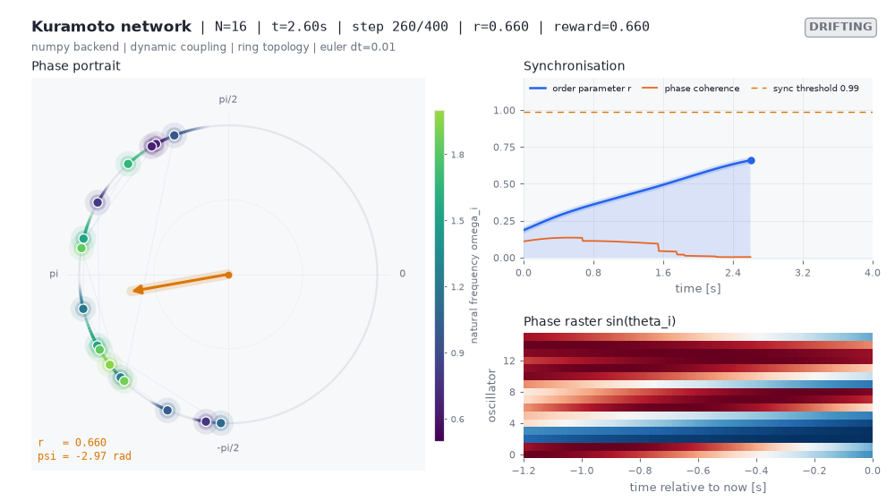
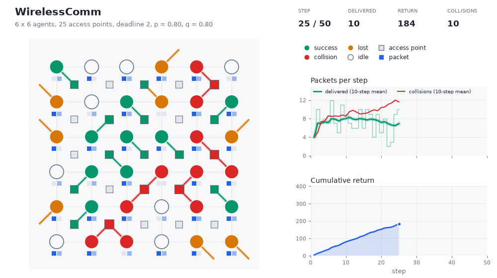
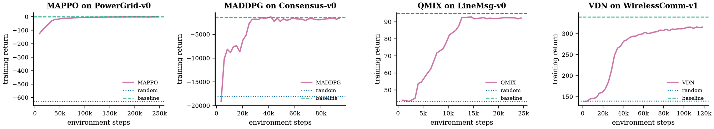
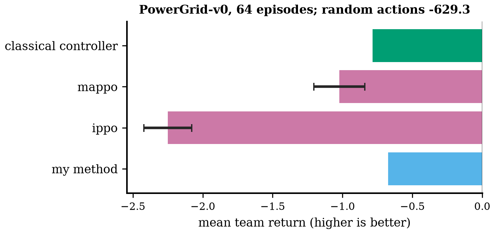
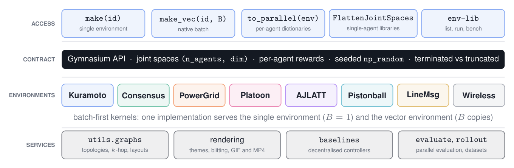

# My Tool Box

**Networked multi-agent control environments, classical MARL algorithms and research utilities for Python.**

[](https://github.com/EricDMW/My_Tool_Box/actions/workflows/ci.yml)


My Tool Box simulates systems in which many agents act on continuous physical
quantities and interact through a network: generators holding the grid
frequency, vehicles keeping a safe gap, oscillators synchronising, robots
tracking targets as a team. Every environment speaks the Gymnasium API,
simulates thousands of copies as one batch, and comes with a classical
controller to compare against. The `marl_algorithms` package trains seven
classical multi-agent reinforcement learning algorithms (IPPO, MAPPO, MADDPG,
MATD3, IQL, VDN and QMIX) directly on these environments, and the `toolkit`
package covers the rest of a study: publication-quality plots, neural-network
building blocks and reproducible experiment parameters.

<p align="center">
  
</p>

**Introduction slides:** [`docs/slides/my_tool_box_slides.pdf`](docs/slides/my_tool_box_slides.pdf)
&nbsp;&middot;&nbsp; **Handbook:** [`docs/manual/main.pdf`](docs/manual/main.pdf)
&nbsp;&middot;&nbsp; **Changes:** [`CHANGELOG.md`](CHANGELOG.md)

## Highlights

- **Networked by construction.** Agents interact through an explicit graph
  that every networked environment exposes (`env.adjacency`). Shared
  topologies, Laplacians and `k`-hop neighbourhoods live in
  `env_lib.utils.graphs`, and observations are local to each agent.
- **Continuous control in physical units.** Power-grid swing dynamics,
  vehicle platoons with actuator lag, oscillator networks, single and double
  integrators, and range-bearing target tracking, each with documented
  observation layouts, units and bounds.
- **Fast.** Environments are written batch-first: `env_lib.make_vec(id, 256)`
  advances all copies with a few array operations, 2 to 3 million agent-steps
  per second on one CPU core and 33 to 44 times the throughput of Gymnasium's
  `SyncVectorEnv`. Evaluating 1024 PowerGrid episodes takes about a second.
- **Convenient.** One catalogue (`env_lib.catalog()`, `env-lib list`), one
  command to run, record, evaluate or benchmark any environment, adapters for
  single-agent libraries and the PettingZoo parallel API, and
  `env_lib.baseline_policy(env)`, a decentralised classical controller for
  every environment.
- **Algorithms included.** Seven classical MARL methods share one small core
  and train on the batched environments in one call
  (`marl_algorithms.train("mappo", "PowerGrid-v0", 250_000)`) or one command
  (`marl-train run mappo PowerGrid-v0`); tuned presets learn in one to two
  minutes on one CPU core and are evaluated against the classical controller.
  `marl_algorithms.compare` turns them into ready-made baselines for your own
  method: one call trains them over several seeds and evaluates them with the
  classical controller, random actions and your policy on the same episodes.
- **Reproducible.** Randomness comes only from seeded generators, rendering
  works headless in dark and light themes, and episodes export to GIF, MP4 or
  `.npz` trajectories.
- **One install for the whole study.** `toolkit.plotkit` for figures with
  confidence bands, `toolkit.neural_toolkit` for PyTorch policies and critics,
  `toolkit.parakit` for experiment parameters.

## Installation

Python 3.9 or newer. From a clone of the repository:

```bash
git clone https://github.com/EricDMW/My_Tool_Box.git
cd My_Tool_Box
pip install -e ".[all]"
```

The core install needs only NumPy, SciPy, matplotlib, Gymnasium and PyYAML.
Heavier dependencies are extras:

| Extra | Adds | Needed for |
|---|---|---|
| `torch` | PyTorch | `marl_algorithms`, `KuramotoOscillatorTorch-*`, `toolkit.neural_toolkit` |
| `pistonball` | pygame, pymunk | `Pistonball-v0` |
| `video` | imageio, imageio-ffmpeg | MP4 export (GIF export works without it) |
| `dev` | pytest, pytest-cov, ruff | tests and linters |
| `all` | all of the above except `dev` | |

## Quick start

```python
import env_lib

env = env_lib.make("PowerGrid-v0", render_mode="rgb_array")
obs, info = env.reset(seed=0)              # (n_agents, obs_dim) float32
policy = env_lib.baseline_policy(env)      # droop control, from the observation
obs, reward, terminated, truncated, info = env.step(policy(obs))
info["agent_rewards"]                      # per-agent rewards, shape (n_agents,)
frame = env.render()                       # (H, W, 3) uint8 dashboard

# 1024 copies simulated as one batch, evaluated in parallel
envs = env_lib.make_vec("PowerGrid-v0", num_envs=1024)
print(env_lib.evaluate(envs, policy, n_episodes=1024, seed=0))
```

Plug the same environments into existing learners:

```python
from env_lib.wrappers import FlattenJointSpaces, to_parallel

flat = FlattenJointSpaces(env_lib.make("Platoon-v0"))  # 1-D spaces for single-agent libraries
par = to_parallel("Platoon-v0")                        # PettingZoo parallel API, per-agent dicts
```

Train a classical multi-agent algorithm on them:

```python
from marl_algorithms import train

algo, log = train("mappo", "PowerGrid-v0", total_steps=250_000, num_envs=16)
print(log.summary())
print(algo.evaluate(env_lib.make_vec("PowerGrid-v0", 64), n_episodes=64, seed=1))
```

Compare your own method with all of them, as baselines, on the same episodes
([details](#using-the-algorithms-as-baselines)):

```python
from marl_algorithms import compare

report = compare("PowerGrid-v0", seeds=(0, 1, 2), policies={"mine": my_policy})
print(report)                              # random, controller, IPPO, MAPPO, MADDPG, MATD3, mine
```

Or stay in the shell:

```bash
marl-train run mappo PowerGrid-v0                  # tuned preset, then random / trained / baseline
marl-train compare PowerGrid-v0 --seeds 0 1 2      # every preset algorithm as a baseline
env-lib list --continuous                          # catalogue of continuous environments
env-lib describe Platoon-v0                        # spaces, observation layout, parameters
env-lib run Formation-v0 --gif renders/run.gif     # roll out the baseline and record it
env-lib evaluate PowerGrid-v0 --num-envs 64        # random versus baseline, in parallel
env-lib bench Platoon-v0 --num-envs 1024           # single, native batch and Sync throughput
```

## Environments

Eighteen registered configurations in eight families. Observations are stacked
per agent as `(n_agents, obs_dim)`; the table lists the default configuration.

**Continuous states and actions**

| Id | System | State and dynamics | Action per agent | Agents | Native batch |
|---|---|---|---|---:|:---:|
| `PowerGrid-v0` | frequency control of a transmission network | bus angles and frequencies, swing equations | bounded power injection | 16 | yes |
| `Platoon-v0` | cooperative adaptive cruise control | gaps, speeds, accelerations with actuator lag | commanded acceleration | 8 | yes |
| `Consensus-v0`, `Formation-v0` | rendezvous and formation over a communication graph | planar positions (and velocities), single or double integrator | velocity or acceleration | 8 | yes |
| `KuramotoOscillator-*` | synchronisation of coupled oscillators | phases, phase-coupled dynamics | control inputs and coupling gains | network | yes |
| `KuramotoOscillatorTorch-*` | the same on PyTorch, batched on CPU or GPU | | | network | tensors |
| `AJLATT-v0` | joint localisation and target tracking by a robot team | poses, EKF beliefs fused by covariance intersection | linear and angular velocity | 4 | |
| `Pistonball-v0` | cooperative rigid-body physics | ball and piston states (pymunk) | piston velocity (or discrete) | 20 | |

**Discrete networked benchmarks**

| Id | System | Action per agent | Agents |
|---|---|---|---:|
| `LineMsg-v0` | relay a message along a line of lossy links | relay or not | 10 |
| `WirelessComm-v0`, `-v1` | deliver packets through shared access points | idle or one of four access points | 36 / 16 |

| Power grid (`PowerGrid-v0`) | Vehicle platoon (`Platoon-v0`) |
|---|---|
|  |  |
| **Formation control (`Formation-v0`)** | **Multi-robot target tracking (`AJLATT-v0`)** |
|  |  |
| **Kuramoto synchronisation** | **Wireless access grid** |
|  |  |

Every environment ships a decentralised baseline, returned by
`env_lib.baseline_policy(env)`:

| Environment | Baseline controller | Random | Baseline |
|---|---|---:|---:|
| `PowerGrid-v0` | droop control, u_i = -k omega_i | -569 | -0.8 |
| `Platoon-v0` | CACC, u_i = k_p e_i + k_d dv_i + k_a a_(i-1) | -5270 | -47 |
| `Consensus-v0` | Laplacian protocol | -17178 | -1414 |
| `Formation-v0` | Laplacian protocol on formation offsets | -18011 | -1608 |
| `KuramotoOscillator-FreqSync-Constant-v0` | frequency compensation and phase feedback | -117 | -104 |
| `AJLATT-v0` (no collision termination) | encircle the target belief | -33113 | -7109 |
| `Pistonball-v0` | ramp towards the ball | -205 | 841 |
| `LineMsg-v0` | always relay | 43 | 95 |
| `WirelessComm-v0` | collision-free access schedule | 388 | 924 |

Mean return over 64 seeded episodes (8 for AJLATT, 16 for Pistonball),
higher is better, measured with `env_lib.evaluate` on vector environments.

## Multi-agent reinforcement learning algorithms

`marl_algorithms` implements seven classical methods against one small core:
a per-agent view of the joint spaces (`MultiAgentSpec`), experience collection
on the native batched environments, rollout and replay buffers, network
building blocks with shared or per-agent parameters, and two training loops.
Every algorithm acts on per-agent observations, saves and loads, and evaluates
through `env_lib.evaluate`.

| Algorithm | Family | Actions | Idea | Reference |
|---|---|---|---|---|
| IPPO | on-policy | continuous, discrete | PPO per agent on its own observation and reward | de Witt et al., 2020 |
| MAPPO | on-policy | continuous, discrete | decentralised actors, centralised critic V(s, i) | Yu et al., 2022 |
| MADDPG | off-policy actor-critic | continuous | deterministic actors, centralised Q-critics on joint actions | Lowe et al., 2017 |
| MATD3 | off-policy actor-critic | continuous | MADDPG with twin critics, target smoothing, delayed actors | Ackermann et al., 2019 |
| IQL | value-based | discrete | independent DQN per agent | Tan, 1993 |
| VDN | value-based | discrete | team value as the sum of agent utilities | Sunehag et al., 2018 |
| QMIX | value-based | discrete | monotonic, state-conditioned mixing of agent utilities | Rashid et al., 2018 |

Every preset trained on one CPU core and was then evaluated, with its
deterministic policy, on 64 seeded episodes against uniformly random actions
and the environment's classical controller (mean return, higher is better;
time is CPU seconds of training; reproduce with `benchmarks/benchmark_marl.py`):

| Algorithm | Environment | Env steps | Time [s] | Random | Trained | Baseline |
|---|---|---:|---:|---:|---:|---:|
| IPPO | `PowerGrid-v0` | 200,704 | 69 | -629.3 | -2.37 | -0.79 |
| IPPO | `Platoon-v0` | 450,560 | 88 | -5,350 | -84.8 | -46.4 |
| IPPO | `Consensus-v0` | 401,408 | 83 | -18,041 | -1,550 | -1,518 |
| IPPO | `LineMsg-v0` | 100,800 | 26 | 43.2 | 95.0 | 95.0 |
| MAPPO | `PowerGrid-v0` | 251,904 | 106 | -629.3 | -0.89 | -0.79 |
| MAPPO | `Platoon-v0` | 450,560 | 102 | -5,350 | -65.0 | -46.4 |
| MAPPO | `Consensus-v0` | 401,408 | 96 | -18,041 | -1,586 | -1,518 |
| MAPPO | `LineMsg-v0` | 100,800 | 26 | 43.2 | 95.0 | 95.0 |
| MADDPG | `PowerGrid-v0` | 64,000 | 70 | -629.3 | -5.69 | -0.79 |
| MADDPG | `Consensus-v0` | 96,000 | 72 | -18,041 | -1,681 | -1,518 |
| MATD3 | `PowerGrid-v0` | 64,000 | 87 | -629.3 | -5.63 | -0.79 |
| MATD3 | `Consensus-v0` | 96,000 | 83 | -18,041 | -1,737 | -1,518 |
| IQL | `LineMsg-v0` | 25,008 | 9 | 43.2 | 95.0 | 95.0 |
| VDN | `LineMsg-v0` | 25,008 | 10 | 43.2 | 95.0 | 95.0 |
| VDN | `WirelessComm-v1` | 120,000 | 74 | 139.2 | 338.0 | 339.6 |
| QMIX | `LineMsg-v0` | 25,008 | 16 | 43.2 | 95.0 | 95.0 |
| QMIX | `WirelessComm-v1` | 100,000 | 101 | 139.2 | 319.1 | 339.6 |

The learned policies are far better than random everywhere. Several match the
classical controller (MAPPO on PowerGrid and all methods on LineMsg, and IPPO
and MAPPO on Consensus and VDN on WirelessComm come within about 5 per cent);
the rest stay within a small factor. The team-reward methods also show why
credit assignment matters: on WirelessComm, independent Q-learning (IQL, not
listed) stays near random because a collision costs the sending agent nothing,
while VDN reaches the collision-free schedule.

<p align="center">
  
</p>

### Using the algorithms as baselines

Every environment comes with three kinds of reference for a new method:
random actions, its classical controller (`env_lib.baseline_policy`) and the
seven learning algorithms with tuned presets. `marl_algorithms.compare` trains
the learning baselines over several seeds and evaluates everything, your
method included, on the same seeded episodes:

```python
from marl_algorithms import compare

report = compare(
    "PowerGrid-v0",
    ["mappo", "ippo"],                    # default: every algorithm with a preset here
    seeds=(0, 1),
    policies={"my method": my_policy},    # (num_envs, n_agents, obs_dim) -> actions
)
print(report)
report.to_csv("results/power_grid.csv")  # also .to_markdown() and .records()
mappo = report.algorithms[("mappo", 0)]   # the trained baselines, ready to save or record
```

```
PowerGrid-v0: mean team return over 64 evaluation episodes (seed 1); higher is better

method     kind       mean return    std  seeds  env steps  train [s]
---------  ---------  -----------  -----  -----  ---------  ---------
random     reference       -629.3      -      -          -          -
baseline   reference       -0.786      -      -          -          -
mappo      algorithm        -1.02  0.182      2    251,904      101.9
ippo       algorithm        -2.25  0.172      2    200,704       65.2
my method  policy          -0.675      -      -          -          -
```

`std` is the standard deviation over the training seeds. Here "my method" is a
distributed droop controller that also reacts to the neighbours' mean
frequency deviation ([`examples/algorithms/baseline_comparison.py`](examples/algorithms/baseline_comparison.py),
about six minutes on one core):

<p align="center">
  
</p>

The same from the shell, where `--csv`, `--markdown` and `--save-dir` export
the table and the trained models:

```bash
marl-train compare PowerGrid-v0 --seeds 0 1 2                   # every preset algorithm
marl-train compare LineMsg-v0 --algos iql qmix --markdown --csv results/linemsg.csv
marl-train compare Formation-v0 --algos mappo --steps 200000    # no preset: give a budget
```

A few rules of thumb:

- `total_steps` and `num_envs` (`--steps`, `--num-envs`) replace the presets'
  budget, for a quick check before the full run; algorithms without a preset
  for the environment need `total_steps`.
- `env_kwargs={"n_buses": 32}` (`--env-kwarg n_buses=32`) trains and evaluates
  every method on a variant of the environment with the presets'
  hyperparameters, which may then need more steps.
- A policy written for one environment works after `per_copy(policy)`; a
  modified algorithm of this package is passed as the trained object.
- With training seed 0 and the default evaluation seed 1, the numbers match
  the results table above.

The handbook section "Using the algorithms as baselines" has more recipes.

## Design

<p align="center">
  
</p>

1. **One contract.** Every environment follows the Gymnasium API with joint
   spaces `(n_agents, dim)`, per-agent rewards in `info["agent_rewards"]`,
   `terminated` for task outcomes and `truncated` for its own step limit, and
   randomness from `self.np_random` only.
2. **Batch-first kernels.** Continuous environments implement their dynamics
   once for arrays with a leading batch axis. The single environment is the
   batch of one; `BatchedVectorEnv` runs the same kernels for `B` copies with
   Gymnasium's autoreset modes, and copy 0 reproduces the single environment.
3. **The graph is data.** Interaction topologies are adjacency matrices built
   by `env_lib.utils.graphs` and exposed by the environments, so analysis,
   neighbourhood truncation and rendering use the same object.
4. **Baselines from observations.** Reference controllers are pure functions
   of the observation, which keeps them decentralised and lets one call drive
   a single environment or a batch of thousands.
5. **Light core, lazy extras.** `import env_lib` loads no optional
   dependency; renderers, PyTorch and pymunk are imported on first use.

## Performance

Measured on one core of an Intel Xeon at 2.8 GHz (`OMP_NUM_THREADS=1`,
Python 3.11, NumPy 2.4). Reproduce with `benchmarks/benchmark_vector.py` and
`benchmarks/benchmark_envs.py`.

**Batched simulation.** Environment steps per second with random actions,
automatic resets included:

| Environment | agents | 1 copy | 256 copies, native | 256 copies, `SyncVectorEnv` | speed-up | agent-steps/s (256) |
|---|---:|---:|---:|---:|---:|---:|
| `PowerGrid-v0` | 16 | 3.3k | 134k | 3.1k | 43x | 2.1M |
| `Platoon-v0` | 8 | 7.1k | 295k | 7.4k | 40x | 2.4M |
| `Consensus-v0` | 8 | 7.9k | 345k | 8.7k | 40x | 2.8M |
| `Formation-v0` | 8 | 7.9k | 313k | 8.3k | 38x | 2.5M |
| `KuramotoOscillator-v0` | 10 | 6.9k | 316k | 9.6k | 33x | 3.2M |

`SyncVectorEnv` stays at a few thousand steps per second whatever the batch
size; the native implementations keep scaling (Platoon reaches 4.2 million
agent-steps per second with 1024 copies). Every copy of a native vector
environment reproduces the single environment started from the same state.

**Single environments.** Mean time per step, and the speed-up over the
implementations that preceded version 1.0:

| Environment | before 1.0 | 1.1 | speed-up |
|---|---:|---:|---:|
| Kuramoto, NumPy, 50 oscillators | 2.36 ms | 0.09 ms | 25x |
| Kuramoto, PyTorch, 50 oscillators x 8 systems | 10.3 ms | 0.45 ms | 23x |
| WirelessComm, 12x12 | 0.56 ms | 0.06 ms | 9x |
| Pistonball, 20 pistons | 1.11 ms | 0.08 ms | 14x |
| AJLATT, `obstacles04`, 4 robots | 90 ms | 4.7 ms | 19x |
| PowerGrid, 16 buses | new | 0.25 ms | |
| Platoon, 8 followers | new | 0.13 ms | |

Rendering an `rgb_array` dashboard frame takes 15 to 50 ms. Refactors that were
not meant to change results were checked against the previous implementation:
the AJLATT, Kuramoto and Consensus speed-ups of 1.1 are bitwise identical.

## Documentation

- **Handbook** (`docs/manual/main.pdf`, built by `docs/manual/build.sh`): model
  equations, observation layouts, parameters and rendering of every
  environment, the workflow chapter (vectorised simulation, adapters,
  baselines, evaluation), the multi-agent RL algorithms and their use as
  baselines, the toolkit, examples, troubleshooting, an API reference and a
  migration guide.
- **Slides** (`docs/slides/my_tool_box_slides.pdf`, built by
  `docs/slides/build.sh`): a short introduction to the package.
- **Examples** (`examples/`, see `examples/README.md`), grouped by topic:
  `getting_started/` (every environment, the end-to-end workflow),
  `environments/` (one script per environment with its classical controller),
  `algorithms/` (`marl_training_demo.py` trains MAPPO, MADDPG, QMIX and VDN on
  four environments; `baseline_comparison.py` compares a proposed controller
  with the baselines) and `toolkit/`.

## Development

```bash
pip install -e ".[all,dev]"
pytest -q                                          # test suite
ruff check src tests examples benchmarks           # lint
ruff format src tests examples benchmarks          # format
python benchmarks/benchmark_envs.py                # single-environment timings
python benchmarks/benchmark_vector.py              # batched throughput
python benchmarks/benchmark_marl.py                # train and evaluate every MARL preset
```

Tests run headless (`tests/conftest.py` selects matplotlib's Agg backend and
SDL's dummy video driver). Continuous integration runs lint, tests and example
smoke tests on Python 3.9 to 3.12.

## License

MIT License, see `LICENSE`. Copyright (c) 2025 Dongming Wang (EricDMW).
